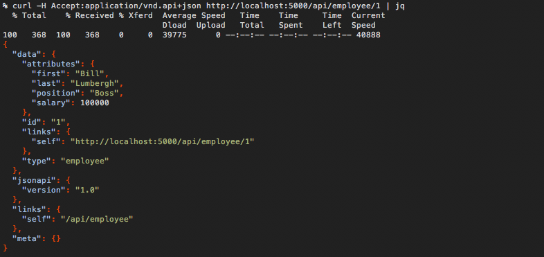

# flask-skeleton

A "hello world" style Flask web server application that (optionally) runs on
Heroku. Some notable parts used in this web application are:

  1. [Flask](http://flask.pocoo.org/)
  2. [Gunicorn](http://gunicorn.org/)
  3. [Flask-Restless](https://flask-restless.readthedocs.org/en/latest/)
  4. [Flask-SQLAlchemy](https://pythonhosted.org/Flask-SQLAlchemy/)
  5. [Flask-Bootstrap](http://pythonhosted.org/Flask-Bootstrap/)
  6. [Flask-Script](http://flask-script.readthedocs.org/en/latest/)

## development

Before you get started you'll need to have Python 2.7+ installed. After, you'll
need to also instal virtualenv. Research how to do this for whatever platform
you run before continuing.

### setup a virtualenv

Create a virtual environment the web application by running the following
commands in a terminal.

```bash
virtualenv my-venv
source my-venv/bin/activate
pip install --upgrade pip
pip install -r requirements.txt
python setup.py develop
```

### start the web server

Before you start the web server you should prime the database with a few sample
entries.

```bash
./manage.py prime_database
```

Then, start the web server on your local machine using Flask-Manager.

```bash
./manage.py runserver
```

Then, in your browser, navigate to http://127.0.0.1:5000/. You should see
something like the following image.


Then, on your CLI, use curl and jq to inspect the JSON API that follows [JSON
Schema](http://json-schema.org/).

.
